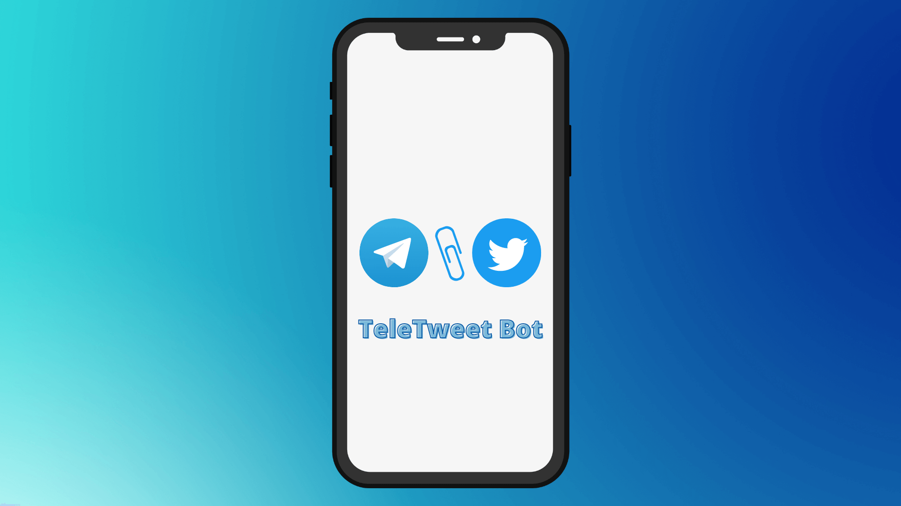

## 🐦 TeleTweet Bot 💙



A small open-source Twitter client packaged as a Telegram Bot! A project born out of boredom.

With this bot, you can send and schedule your tweets and threads right from Telegram!

If you like the bot, buy me a coffe☕ [here](https://www.buymeacoffee.com/crypticcode)

## Configuration ⚙

#### Dependencies

1. Create a virtual environment:
```sh
python -m venv venv
```
1. Activate the virtual environment and run the following command:
```sh
pip install -r requirements.txt
```

#### Environment Variables

- Your Telegram bot's access token should be set as `TELEGRAM_TOKEN`
- Your Twitter API Key and Secret should be set as `TWITTER_KEY` and `TWITTER_SECRET`
- Your app's base url should be set as `APP_URL`
- As well as an admin password should be set as `ADMIN_PASS` for authorizing convenience requests such as setting commands and deleting webhook.

Put it in a `.env` file for local development:

```
TELEGRAM_TOKEN=<your-token-here>
TWITTER_KEY=<your-key-here>
TWITTER_SECRET=<your-secret-key-here>
ADMIN_PASS=<your-password-here>
APP_URL=<your-url-here>
```

Note: Depending on your environment, you might also need a Project key for Database initialization in here.

#### Convenience Endpoints
All these endpoints only work with `Passkey` header set to your admin password with the request.

- `/set-webhook` to register/update the webhook.
- `/delete-webhook` to delete the registered webhook.
- `/set-commands` to set/update the registered bot's commands list.

#### Characters to be escaped in MarkdownV2
```
_  *  [  ]  (  )  ~  `  >  #  +  -  =  |  {  }  .  !
```
